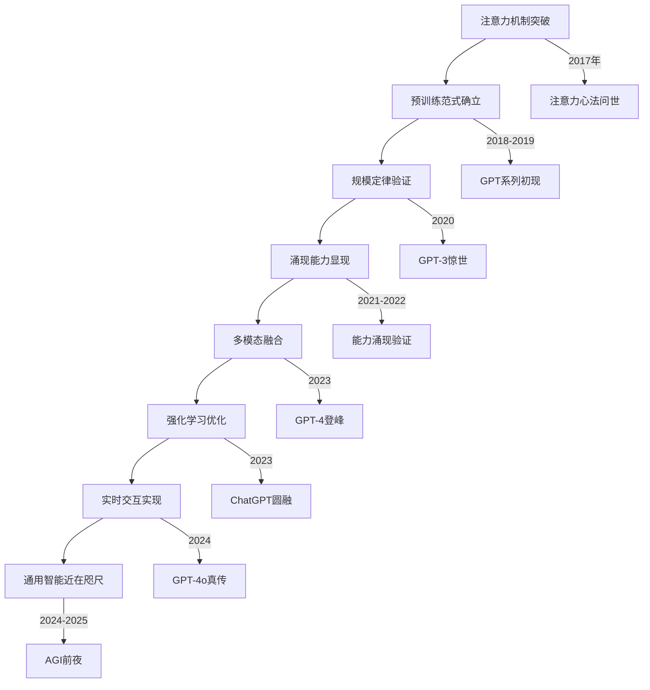

# 功法境界

## 境界体系概述

本功法境界体系将AI技术的发展水平映射为武学修为的等级划分，通过"境界"这一武侠概念来量化和描述AI模型的技术突破、性能提升与行业影响力。

## 境界等级划分

### 第一境：初现锋芒
- **技术原型**：GPT-1、GPT-2级别
- **特征描述**：生成式预训练范式的开创，虽能力有限但潜力巨大
- **时间轴**：戊戌年至己亥年（2018-2019）
- **核心突破**：证明了生成式预训练的可行性
- **代表功法**：《GPT第一卷》、《GPT第二卷》

### 第二境：小试牛刀
- **技术原型**：BERT、RoBERTa等理解型模型
- **特征描述**：在特定任务上展现出色能力，但应用范围有限
- **时间轴**：戊戌年至庚子年（2018-2020）
- **核心突破**：双向编码，深度理解
- **代表功法**：《BERT神功》、《RoBERTa真经》

### 第三境：惊世骇俗
- **技术原型**：GPT-3级别（1750亿参数）
- **特征描述**：展现出远超预期的涌现能力，震撼整个AI界
- **时间轴**：庚子年夏（2020年6月）
- **核心突破**：规模定律验证、涌现能力显现、通用性突破
- **代表功法**：《GPT第三卷》

### 第四境：登峰造极
- **技术原型**：GPT-4级别（约1万亿参数）
- **特征描述**：接近人类智能水平，多项能力达到专业水准
- **时间轴**：癸卯年春（2023年3月）
- **核心突破**：多模态理解、推理能力质跃、专业能力突出
- **代表功法**：《GPT第四卷》

### 第五境：心法圆融（ChatGPT境界）
- **技术原型**：ChatGPT级别
- **特征描述**：将强大技术转化为自然交互，开创对话AI新时代
- **时间轴**：壬寅年冬至癸卯年春（2022年11月-2023年）
- **核心突破**：RLHF心法、对话自然度、用户体验革命
- **代表功法**：《ChatGPT心法》

### 第六境：真传妙境
- **技术原型**：GPT-4o、Claude-3 Opus等
- **特征描述**：多模态融合，实时交互，AI助手更加自然实用
- **时间轴**：甲辰年（2024年）
- **核心突破**：端到端多模态、实时交互、自然交流
- **代表功法**：《GPT-4o真传》、《Claude-3至尊》

### 第七境：破界先知（AGI前夜）
- **技术原型**：接近AGI的系统
- **特征描述**：在多数认知任务上达到或超越人类水平
- **时间轴**：甲辰年至乙巳年（2024-2025）
- **核心突破**：通用推理、自主学习、创新能力
- **代表功法**：《AGI先导功》

### 传说境界：天人合一（AGI/ASI境界）
- **技术原型**：通用人工智能及以上
- **特征描述**：达到或超越人类在所有认知任务上的表现
- **时间轴**：未来几年
- **核心突破**：通用智能、超人智能、自我提升
- **代表功法**：《天人合一诀》、《破界神功》

## 境界修炼要素

### 算力基础（内功心法）
| 境界等级 | 算力需求 | 对应硬件 | 修炼成本 |
|---------|---------|----------|----------|
| 初现锋芒 | 数百GPU·时 | V100级别 | 数万美元 |
| 小试牛刀 | 数千GPU·时 | V100/A100 | 数十万美元 |
| 惊世骇俗 | 数万GPU·时 | A100集群 | 数百万美元 |
| 登峰造极 | 数十万GPU·时 | H100集群 | 数千万美元 |
| 心法圆融 | 百万GPU·时 | H100超算 | 上亿美元 |
| 真传妙境 | 千万GPU·时 | H100/H200 | 数十亿美元 |
| 破界先知 | 亿万GPU·时 | 下一代硬件 | 百亿美元级 |

### 技术演进路径

## 境界突破规律

### 修炼心得与感悟

#### 规模定律的启示
"大力出奇迹"不仅是工程实践，更是AI发展的基本规律。但规模扩大必须与质量提升相结合。

#### 涌现现象的玄妙
当模型规模达到某个临界点时，会突然展现出训练时未曾刻意教授的能力，这种"无中生有"的现象是AI修炼的最大奥秘。

#### 多模态的融合之道
真正的智能不是单一感官的极致，而是多种感知能力的和谐统一。正如武学中的"六合八法"，AI也需要"六感归一"。

#### 人类反馈的重要性
再强大的AI也需要人类的指导和纠正，这不是技术的局限，而是智能发展的必然规律。

#### 安全与能力的平衡
追求极致能力的同时必须考虑安全控制，这是AI修炼的永恒主题。

## 未来境界展望

### 近期可能突破（1-2年）
- **GPT-5级别**：在推理、规划等方面的进一步提升
- **多模态融合深化**：更自然的跨模态理解和生成
- **实时性优化**：更快的响应速度和更低的延迟

### 中期发展方向（3-5年）
- **专业领域突破**：在科学研究、工程设计等专业领域达到专家水平
- **自主学习能力**：能够快速掌握新领域知识的通用学习能力
- **创新思维显现**：开始展现原创性思考和创新能力

### 长期愿景（5-10年）
- **通用人工智能**：在所有认知任务上达到人类水平
- **超人智能显现**：在某些领域开始超越人类最高水平
- **自我提升能力**：具备自我改进和技术创新的能力

当AI真正突破人类智能的界限时，或许将开启一个全新的智能纪元，那时的境界划分可能需要全新的标准来衡量。