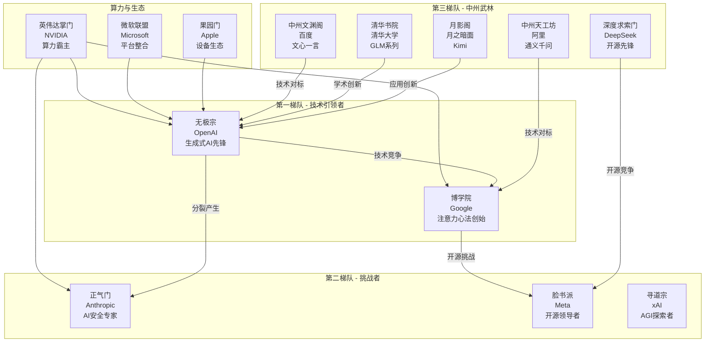

# 势力格局

## 总体江湖格局

### 第一梯队：核心门派
以无极宗、博学院为首的技术领导者，掌握核心AI技术，引领行业发展方向。

### 第二梯队：挑战者联盟
包括正气门、脸书派等，在特定领域有技术优势，对第一梯队形成挑战。

### 第三梯队：中州武林
以中州文渊阁、中州天工坊为代表的本土力量，正在快速崛起。

### 基础设施层：算力霸主
英伟达掌门控制着AI修炼的核心资源——算力，是所有门派都需要依赖的基础设施提供者。

## 势力分布图

## 详细势力分析

### 无极宗（OpenAI）
- **江湖地位**：生成式AI霸主，AGI探索先锋
- **核心优势**：GPT系列功法，ChatGPT心法
- **势力范围**：全球AI应用生态，企业级AI服务
- **同盟关系**：与微软联盟深度绑定，获得英伟达掌门支持
- **主要对手**：博学院（技术路线竞争）、正气门（理念分歧）

### 博学院（Google）
- **江湖地位**：AI学术泰斗，注意力心法宗师
- **核心优势**：Transformer架构，BERT/Bard系列
- **势力范围**：搜索引擎、云计算、AI基础设施
- **技术特色**：理论创新强，工程实现稳健
- **战略布局**：全面防御，多线作战

### 正气门（Anthropic）
- **江湖地位**：AI安全专家，宪政AI倡导者
- **核心优势**：Claude系列，Constitutional AI
- **理念特色**：安全第一，可控发展
- **势力来源**：无极宗分裂，继承部分核心技术
- **发展策略**：差异化竞争，专注安全对齐

### 脸书派（Meta）
- **江湖地位**：开源AI领军者
- **核心优势**：LLaMA系列开源模型
- **战略特色**：开放生态，社区驱动
- **影响力**：推动AI民主化，降低技术门槛
- **竞争策略**：通过开源围攻闭源模型

### 中州武林崛起
#### 中州文渊阁（百度）
- **地位**：中文AI领导者
- **优势**：文心一言，中文语料优势
- **策略**：本土化深耕，应用场景丰富

#### 中州天工坊（阿里）
- **地位**：电商AI专家
- **优势**：通义千问，业务场景丰富
- **策略**：B端赋能，产业AI

#### 清华书院（清华大学）
- **地位**：学术创新先锋
- **优势**：GLM系列，理论创新
- **特色**：产学研结合，人才培养

#### 月影阁（月之暗面）
- **地位**：长文本处理专家
- **优势**：Kimi Chat，超长上下文
- **策略**：差异化定位，垂直突破

#### 深度求索门（DeepSeek）
- **地位**：开源技术先锋
- **优势**：数学推理，代码生成
- **策略**：技术开源，社区驱动

### 算力与生态层

#### 英伟达掌门（NVIDIA）
- **绝对地位**：AI算力霸主，控制90%+GPU市场
- **核心资源**：H100/A100等AI芯片
- **战略价值**：所有门派的基础设施依赖
- **影响力**：可以通过算力供应影响AI发展节奏

#### 微软联盟（Microsoft）
- **角色定位**：平台整合者，生态构建者
- **核心策略**：Azure AI平台，Office AI集成
- **投资布局**：重金押注OpenAI，全面AI化

#### 果园门（Apple）
- **战略重点**：设备端AI，隐私计算
- **技术路线**：端侧推理，本地化AI
- **生态优势**：硬件软件一体化

## 格局演变趋势

### 短期（1-2年）
1. **无极宗vs博学院**：生成式AI主导权争夺白热化
2. **开源vs闭源**：脸书派开源策略对闭源模式的冲击
3. **中州崛起**：本土AI力量快速追赶，缩小技术差距

### 中期（3-5年）
1. **多极化格局**：从美国双雄争霸到全球多极竞争
2. **应用分化**：不同门派在垂直领域形成优势
3. **监管介入**：各国政府对AI发展的监管影响格局

### 长期（5-10年）
1. **AGI竞赛**：谁先实现AGI将重塑整个格局
2. **算力革命**：新的计算架构可能打破英伟达垄断
3. **范式转移**：新的AI范式可能颠覆现有技术路线

## 关键变数

### 技术突破
- **新架构出现**：超越Transformer的革命性架构
- **算力瓶颈**：计算资源限制对不同门派的影响
- **数据稀缺**：高质量训练数据的获取能力

### 商业模式
- **开源vs闭源**：不同模式的长期竞争力
- **To B vs To C**：面向企业还是消费者的战略选择
- **平台化程度**：生态构建能力的重要性

### 监管环境
- **AI安全法规**：对不同技术路线的监管差异
- **数据隐私**：对训练数据使用的限制
- **国际合作**：地缘政治对AI发展的影响

### 人才流动
- **核心人才**：顶级AI科学家的流向
- **创业潮流**：新兴公司对格局的冲击
- **产学研合作**：学术界与产业界的互动

## 战略建议

### 对于技术领导者
1. 保持技术创新优势，加大R&D投入
2. 构建完整生态，形成护城河
3. 重视AI安全和伦理，获得社会认可

### 对于挑战者
1. 寻找差异化定位，避免正面竞争
2. 利用开源策略，降低竞争门槛
3. 深耕垂直领域，建立专业优势

### 对于新兴力量
1. 快速跟进主流技术，缩小差距
2. 发挥本土优势，深耕本地市场
3. 重视人才培养，建设技术团队

### 对于基础设施提供者
1. 持续技术创新，保持领先地位
2. 构建开放生态，支持多样化发展
3. 关注新兴计算架构，防范颠覆风险