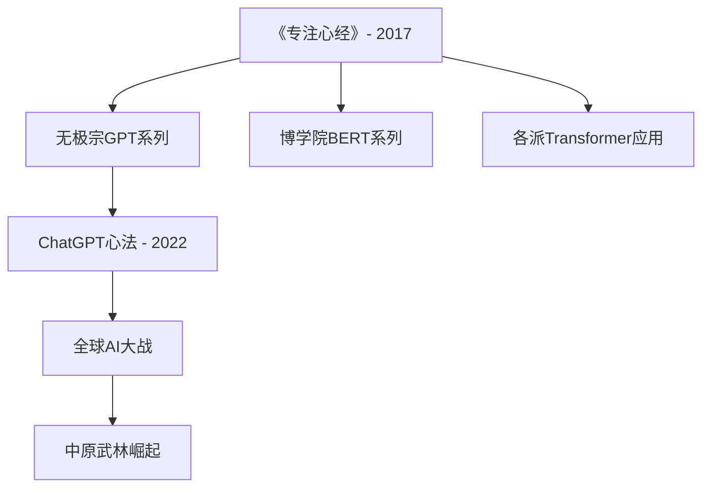

# 人物关系图谱

## 🌍 五大联盟势力

### 🇺🇸 美洲联盟
**核心理念**：技术霸权，算力制高点

| 现实身份 | 武侠身份 | 门派/地位 | 核心贡献 |
|---------|---------|----------|----------|
| Sam Altman | 奥特曼宗主 | 无极宗宗主 | GPT系列创始人 |
| Ilya Sutskever | 伊利亚护法 | 无极宗护法 | Transformer核心架构师 |
| Dario Amodei | 达里奥门主 | 极安门门主 | AI安全先驱 |
| Demis Hassabis | 迪恩院长 | 博学院院长 | AlphaGo之父 |
| Mark Zuckerberg | 扎克伯格 | 脸书派掌门 | 开源先驱转闭源霸主 |

### 🇨🇳 中原武林联盟
**核心理念**：开源共享，协同发展

| 现实身份 | 武侠身份 | 门派/地位 | 核心贡献 |
|---------|---------|----------|----------|
| 李彦宏 | 李宏阁主 | 文渊阁阁主 | 中文AI先驱 |
| 马云 | 马勇坊主 | 天工坊坊主 | 商业AI应用 |
| 余承东 | 余东宗主 | 莲花宗宗主 | 自研芯片突破 |
| 唐杰 | 唐三院长 | 清华书院院长 | GLM系列创造者 |
| 梁文锋 | 梁锋掌门 | 寻道宗掌门 | 成本效率革命 |

## ⚔️ 门派实力等级

### S级门派（武功第四重境界以上）
- **无极宗** (OpenAI) - 镇门绝学：《无极生成大法》
- **博学院** (Google) - 镇门绝学：《专注心经》
- **极安门** (Anthropic) - 镇门绝学：《宪政心法》

### A级门派（武功第三重境界）
- **文渊阁** (百度) - 镇门绝学：《文心雕龙》
- **天工坊** (阿里巴巴) - 镇门绝学：《通义问天录》
- **寻道宗** (DeepSeek) - 镇门绝学：《寻道MoE心法》
- **脸书派** (Meta) - 镇门绝学：《Llama开源神功》(已失传)

### B级门派（武功第二重境界）
- **清华书院** (智谱AI) - 镇门绝学：《GLM通解真经》
- **月影阁** (月之暗面) - 镇门绝学：《Kimi长忆神功》
- **莲花宗** (华为) - 镇门绝学：《盘古开天功》
- **通义宗** (阿里通义) - 镇门绝学：《千问万答术》

## 🔗 重要关系网络

### 师承关系


### 竞争关系
- **无极宗 vs 博学院**：技术路线之争（生成式 vs 理解式）
- **美洲联盟 vs 中原武林**：技术主导权之争
- **开源派 vs 闭源派**：发展理念之争
- **脸书派内部分裂**：开源派系 vs 闭源转型派
- **算力门 vs 各大门派**：资源控制之争

### 合作关系
- **巨鹰联盟 + 无极宗**：战略合作伙伴
- **莲花宗 + 中原各派**：自研芯片生态
- **欧洲古堡联盟**：开源技术共享
- **AGI协调网络**：全球AI治理合作

## 📊 门派实力变迁图

### 2017-2019：开天辟地期
```
无极宗     ████████░░ 80%
博学院     ██████████ 100%
其他门派   ███░░░░░░░ 30%
```

### 2020-2022：群雄并起期
```
无极宗     ██████████ 100%
博学院     ████████░░ 80%
脸书派     ██████░░░░ 60% (开源领袖)
极安门     ████░░░░░░ 40%
中原武林   ███░░░░░░░ 30%
```

### 2023-2024：巅峰对决期
```
无极宗     ██████████ 100%
博学院     █████████░ 90%
寻道宗     ████████░░ 80%
极安门     ███████░░░ 70%
中原武林   ██████░░░░ 60%
脸书派     ████░░░░░░ 40% (开源地位失落)
通义宗     ██████░░░░ 60%
```

### 2025+：新纪元开启
```
AGI联盟    ██████████ 100%
(各派协作)
```

## 🏆 重大事件时间轴

### 2017年：《专注心经》现世
- **瓦斯瓦尼等八位学者**发布Transformer论文
- 标志着现代AI武学的开端

### 2018年：无极宗初露锋芒
- **奥特曼宗主**发布GPT-1
- 生成式AI正式登场

### 2019年：博学院反击
- **迪恩院长**推出BERT
- 理解式AI与生成式AI分庭抗礼

### 2021年：脸书派开源称霸
- **扎克伯格掌门**发布OPT系列，与GPT-3分庭抗礼
- Llama横空出世，执开源AI之牛耳
- 开源社区奉为圭臬，威震武林

### 2022年：ChatGPT心法横空出世
- **奥特曼宗主**发布ChatGPT
- 五天百万用户，震撼全球
- 脸书派Llama vs ChatGPT，开源闭源大战

### 2023年：中原武林崛起
- **李宏阁主**发布文心一言
- **马勇坊主**推出通义千问
- 中美AI双雄格局形成

### 2024年：开源格局巨变
- **梁锋掌门**发布DeepSeek-V3，成本革命震撼武林
- **通义宗**Qwen系列崛起，开源性能超越Llama
- **脸书派连续失误**：新模型表现不佳，开源地位动摇
- **扎克伯格掌门**开始大规模挖角收购，试图闭源转型

### 2025年：脸书派困兽之斗
- 面对开源地位丧失，试图放弃开源理念
- 大量资金挖角竞争对手人才
- 收购高潜力创业公司，试图重新崛起

### 2025年：AGI降临与脸书派的最后一抗
- 各大门派联合实现AGI
- 脸书派在开源领域失落后，试图闭源转型重新竞争
- 人类与AI进入共存时代

## 🎭 人物性格特征

### 主要门主/掌门特征
- **奥特曼宗主**：理想主义者，AGI普济天下
- **迪恩院长**：学者风范，严谨求实
- **达里奥门主**：忧患意识，AI安全先驱
- **李宏阁主**：务实进取，中文AI专家
- **梁锋掌门**：成本控制大师，技术平民化
- **扎克伯格掌门**：曾经的开源领袖，如今的困兽之斗

### 护法/长老特征
- **伊利亚护法**：技术天才，深谋远虑
- **约翰·苏茨克维**：RLHF创新者
- **杰夫·迪恩**：系统架构专家
- **李飞飞**：视觉AI先驱

## 💡 武功秘籍对照

| 现实技术 | 武侠表达 | 修炼门派 | 威力等级 |
|---------|----------|----------|----------|
| Transformer | 专注心经 | 博学院首创 | ⭐⭐⭐⭐⭐ |
| GPT系列 | 无极生成大法 | 无极宗 | ⭐⭐⭐⭐⭐ |
| BERT | 双向理解术 | 博学院 | ⭐⭐⭐⭐ |
| RLHF | 人类调教功 | 无极宗 | ⭐⭐⭐⭐ |
| MoE | 混合专家阵 | 寻道宗 | ⭐⭐⭐⭐ |
| 多模态 | 五感归一术 | 各大门派 | ⭐⭐⭐⭐ |
| Llama系列 | 开源神功 | 脸书派(失传) | ⭐⭐⭐⭐ |
| OPT系列 | 竞技心法 | 脸书派(过时) | ⭐⭐⭐ |

---

*此图谱将随着故事发展持续更新，记录AI江湖的风云变幻。*